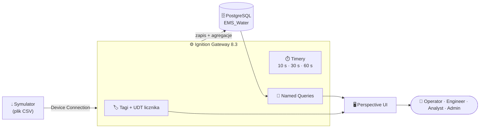
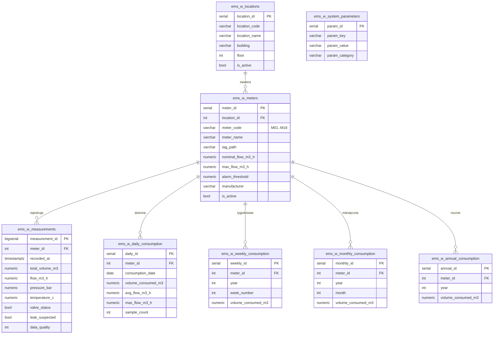
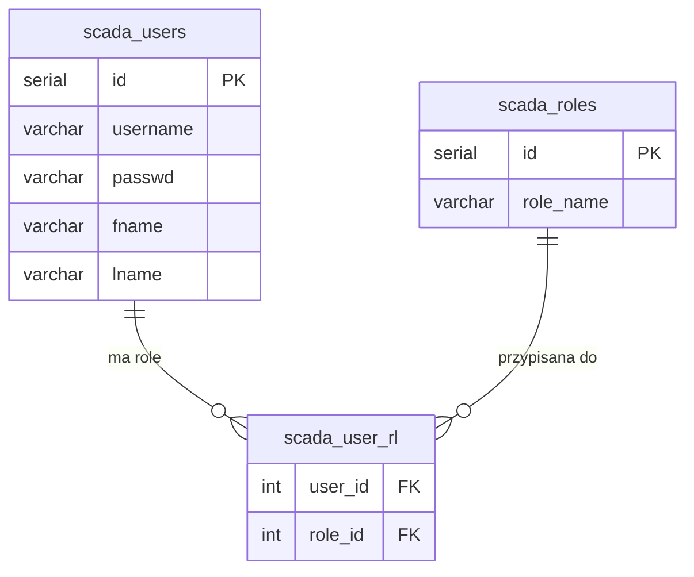

# 💧 EMS Water

### System Zarządzania Wodą · *Energy Management System*

Kompletna aplikacja SCADA/EMS dla zużycia wody — zbudowana w **Ignition 8.3 (Perspective)**
na bazie **PostgreSQL**, z symulatorem 18 liczników, archiwizacją, agregacjami, alarmami i analizą.

 

---

## 📑 Spis treści

- [✨ Funkcje](#-funkcje)
- [🏗️ Architektura](#️-architektura)
- [🗄️ Struktura bazy danych](#️-struktura-bazy-danych)
- [🖥️ Ekrany aplikacji](#️-ekrany-aplikacji)
- [🔐 Użytkownicy i role](#-użytkownicy-i-role)
- [⚙️ Backend](#️-backend)
- [👥 Autorzy](#-autorzy)

---

## ✨ Funkcje

- 💧 **18 liczników wody** (M01–M18) w **6 lokalizacjach** — dane na żywo z symulatora
- 🗄️ **Pełny model danych** w PostgreSQL: konfiguracja, pomiary, agregacje, alarmy
- ⏱️ **Archiwizacja** pomiarów co 10 s + **agregacje** dzienne / tygodniowe / miesięczne / roczne
- 📊 **Dashboardy i raporty** — karty KPI, wykresy trendów, zestawienia per licznik i lokalizacja
- 🔎 **Moduł analiz** — filtrowanie po lokalizacji i okresie, wykresy porównawcze
- 🖥️ **Tabele „pełny ekran"** jednym kliknięciem
- 🔐 **Bezpieczeństwo** — role, Security Levels, Security Zones, użytkownicy z bazy

---

## 🏗️ Architektura

Symulator zasila tagi w Gatewayu → timery archiwizują pomiary i liczą agregacje do bazy →
Named Queries pobierają dane → interfejs **Perspective** prezentuje je użytkownikom wg ról.

---

## 🗄️ Struktura bazy danych

> Schemat encji bazy **EMS_Water** (PostgreSQL). Klucze `PK` / `FK` zaznaczone przy kolumnach.

**Źródło użytkowników** (User Source w bazie):

<b>📋 Grupy tabel (rozwiń)</b>

| Grupa | Tabele |
|-------|--------|
| **Konfiguracja** | `ems_w_locations`, `ems_w_meters`, `ems_w_system_parameters` |
| **Pomiary** | `ems_w_measurements` |
| **Agregacje** | `ems_w_daily_consumption`, `ems_w_weekly_consumption`, `ems_w_monthly_consumption`, `ems_w_annual_consumption` |
| **Użytkownicy** | `scada_users`, `scada_roles`, `scada_user_rl` |

---

## 🖥️ Ekrany aplikacji

| Ekran | Opis |
|-------|------|
| 🏠 **Dashboard** | Karty KPI dla M01 + podgląd na żywo wszystkich liczników, wykres trendu, status |
| 💧 **Liczniki** | Przegląd 18 liczników na żywo z symulatora + KPI wybranych liczników |
| 📊 **Raporty** | Zużycie dzienne / miesięczne / roczne + tabele z trybem „pełny ekran" |
| 🕓 **Historia** | Surowe pomiary z bazy (`ems_w_measurements`) + parametry archiwizacji |
| ⚙️ **Konfiguracja** | Tabele liczników i lokalizacji, podsumowania KPI |
| 📍 **Lokalizacje** | Zużycie dziś wg lokalizacji + szczegóły lokalizacji |
| 📈 **Analiza** | Filtry (lokalizacja + okres), trendy czasowe, wykresy porównawcze |

---

## 🔐 Użytkownicy i role

Role: **Administrator · Engineer · Operator · Analyst** · Strefy: **Plant Zone · Office Zone**

| Login | Imię i nazwisko | Rola | Hasło |
|-------|-----------------|------|-------|
| `admin1` | Adam Nowak | Administrator | = login |
| `engineer1` | Piotr Kowalski | Engineer | = login |
| `engineer2` | Anna Wiśniewska | Engineer | = login |
| `operator1` | Marcin Zieliński | Operator | = login |
| `operator2` | Tomasz Dąbrowski | Operator | = login |
| `analyst1` | Katarzyna Lewandowska | Analyst | = login |

> 🔑 Panel **Ignition Gateway**: `admin` / `admin`

---

## ⚙️ Backend

**Gateway Timer Scripts**

| Timer | Częstotliwość | Zadanie |
|-------|---------------|---------|
| `archiwizacja_pomiarow` | 10 s | Zapis pomiarów z tagów do bazy |
| `agregacja_dobowa` | 30 s | Agregacja dzienna (UPSERT) |
| `agregacja_tygodniowa_miesieczna_roczna` | 60 s | Agregacje tyg. / mies. / roczne |

**Named Queries** — wszystkie zapytania (33) zamknięte w Named Queries, pogrupowane wg funkcji:
`Aggregation` · `Dashboard` · `Analiza` · `Historia` · `Konfiguracja` · `Meter` · `Raporty`.

**Skrypt projektowy** — `ems_users` (odczyt użytkowników z User Source na ekran Konfiguracja).

---

## 👥 Autorzy

**Hubert Zdanowicz** · **Michał Tomys**
Grupa **31INF-PSI-SP** · *Ignition 8.3 z TTPSC — Digital Manufacturing*

 

*Zbudowane z 💧 w Ignition 8.3 + PostgreSQL*

